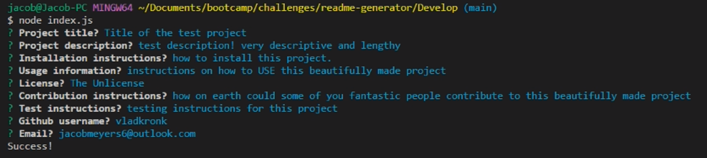
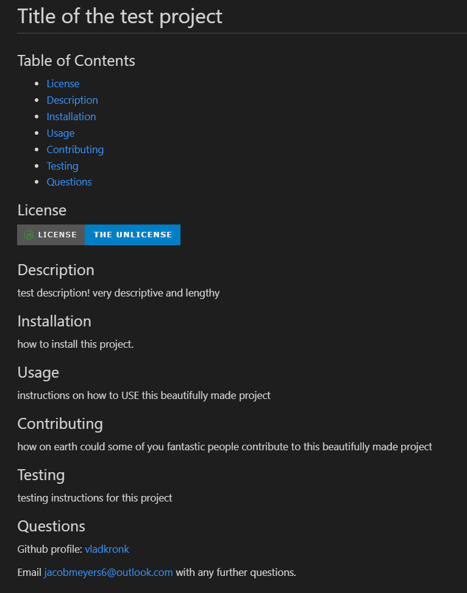

# readme-generator

## Table of Contents

-   [Description](#description)
-   [Photos](#photos)
-   [License](#license)
-   [Demonstration](#demonstration)
-   [Contact](#contact)

## Description

As a University of Washington Coding Boot Camp student, I want to further my back-end development knowledge by using Node to run a console application that generates a professional README markdown file based on a user's input. I built this to make it easier for me and other developers to format a README using a template. This README generator makes it so developers can focus on the content of the readme without worrying about styling and formatting their markdown document.

## Photos

---

## License

Please refer to the LICENSE in the repo.

## Demonstration

<a href="https://drive.google.com/file/d/1FmRbTwAA-KguT6TOPJIPbKouvwyRekfB/view">drive.google.com/file/d/1FmRbTwAA-KguT6TOPJIPbKouvwyRekfB/view</a>

## Contact

<a href="https://www.linkedin.com/in/jmeyers6/" >LinkedIn</a>

<a href="https://github.com/vlad-kronk">Github</a>
